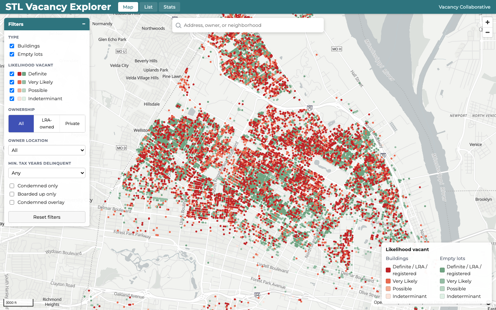
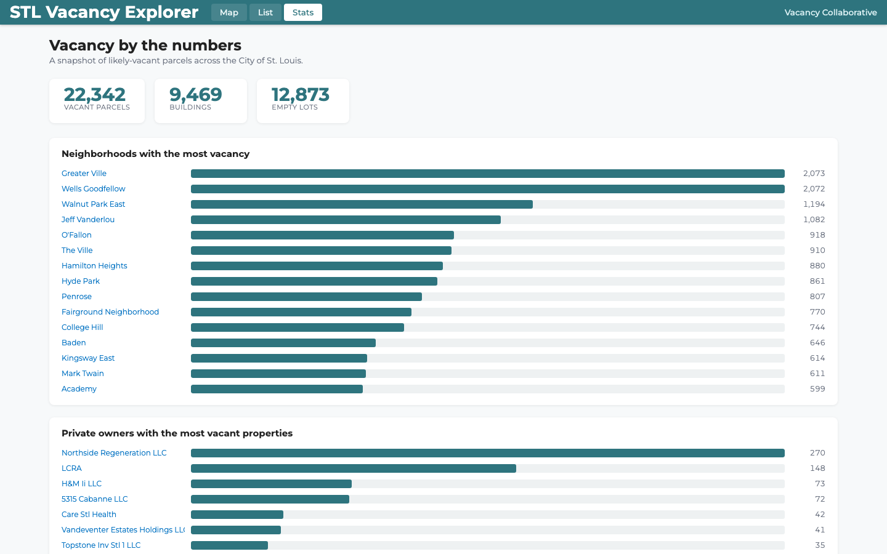

# STL Vacancy Explorer — open rebuild

An open-source rebuild of [stlvacancytools.com](https://www.stlvacancytools.com/) (the *STL Vacancy Explorer*, run by the Public Goodness collaborative), which maps, classifies, and risk-scores every vacant property in the City of St. Louis.

This is a from-scratch reimplementation in a modern stack. The original was reverse-engineered first — see **[REVERSE-ENGINEERING.md](./REVERSE-ENGINEERING.md)** for the full technical spec this build follows.




## Stack

| Concern | Original | This rebuild |
|---|---|---|
| Framework | vanilla JS + jQuery (one 7k-line file) | React + Vite + TypeScript |
| Map | Mapbox GL JS v1 (paid token + tilesets) | **MapLibre GL** (open) + OpenFreeMap base style (no token) |
| State | `window.stlv` global | Zustand store |
| Data | precomputed Mapbox tilesets + Firestore | public CSV → generated GeoJSON (PMTiles planned) |
| Backend | Firebase + 10 Cloud Functions | swappable provider: **mock** (default) or Firebase |

No API keys or paid services are required to run the public explorer.

> **⚠ Security note for the Firebase path.** The mock provider filters case visibility *client-side* because its case data is fictional. In the real system the client-side role is **cosmetic** — protection comes from server-side Firebase security rules (scoping `/apiCases` reads per role) + Cloud Function `idToken` verification (see [REVERSE-ENGINEERING.md](./REVERSE-ENGINEERING.md) §4.3, §11). Any real backend implementing `DataProvider` **must enforce visibility server-side** and never send the browser a case the user isn't authorized to see. Do not port the mock's "fetch-all-then-slice" pattern to real PII.

## Quick start

```bash
npm install
npm run data      # build data artifacts from data/raw/stl_vacancy_data.csv
npm run dev       # http://localhost:5173
```

To refresh the source data from upstream: `npm run data:download && npm run data`.
Real parcel polygons: `npm run data:geometry && npm run data && npm run tiles` (needs [tippecanoe](https://github.com/felt/tippecanoe)).

## Deploy

Deployed to **GitHub Pages** via GitHub Actions (`.github/workflows/`):
- **`deploy.yml`** — on push to `main`, a **weekly cron**, or manual dispatch: rebuilds the data (`data:download` → `data` → asserts the polygon layer is non-empty → `tiles`), builds, and publishes `dist/`. tippecanoe is built once and cached.
- **`refresh-geometry.yml`** — quarterly/on-demand: re-fetches parcel geometry from the city ArcGIS service and publishes it as the `geometry` Release asset that `deploy.yml` seeds from (boundaries change slowly, so they aren't refetched every deploy).

For a GitHub *project* page (`user.github.io/<repo>/`), set the repo variable `VITE_BASE=/<repo>/`; all asset URLs are base-path-aware via `import.meta.env.BASE_URL`. A custom domain / user page needs no `VITE_BASE`.

## Data pipeline (`scripts/`, zero-dependency Node)

- `download.mjs` — fetch the public vacancy CSV (22k parcels) to `data/raw/`.
- `fetch-geometry.mjs` — fetches real parcel polygon geometry from the City of St. Louis assessor ArcGIS service (`maps8.stlouis-mo.gov`, layer 11), joined to our parcels by `Handle`, server-simplified → `data/raw/parcel_geometry.json` (98.6% coverage).
- `build-parcels.mjs` — CSV → `public/data/parcels.json` (centroid backbone, shipped) + `data/build/parcels-poly.geojson` (polygon intermediate, **not** shipped — baked into PMTiles by `npm run tiles`) + `meta.json`.
- `build-mpo.mjs` — rebuild of the original `multi_property_processor`: owner tally → multi-property owners → fuzzy alias grouping → `public/data/mpo.json`.
- `build-stats.mjs` — aggregates for the Stats page → `public/data/stats.json`.
- `build-all.mjs` — runs all of the above (`npm run data`).

## Status

- [x] **Phase 0** — scaffold, data pipeline, MapLibre map of all parcels colored by vacancy certainty, click → side panel.
- [x] **Phase 1** — public-explorer parity: filters (type / certainty / ownership / owner-location / tax-delinquency / condemned / boarded), search (address / owner / neighborhood), MPO owner panel + map highlight, list view + CSV export, stats page, condemned overlay, neighborhood highlight, URL/hash deep-linking. _Deferred:_ real parcel **polygons + PMTiles** (needs St. Louis parcel geometry from city open data — currently rendered as centroid circles, which matches the original's low-zoom layer); Prop-NS / poverty-zone overlays and the vacancy-onset slider (fields absent from the public CSV).
- [x] **Phase 2** — vacancy scoring & timeline engine: faithful TS port of `scoreAndTimeline` + `diminish` + the open-valve loop + Forestry/LRA kickers + verbal bands (`src/scoring/`), fed by **live `vcpp.stldata.org` city data** (CORS-open, fetched directly). Side panel shows the live Vacancy/Burden breakdown (per-factor contributions) + an "Indicators Over Time" event timeline. Validated against the published CSV scores (band agreement within ±2 points; all confirmed-vacant cases exact). _Deferred:_ the 48-month historical sparkline (needs stored monthly snapshots) and the crime/CSB/valuation **percentile comparison** (needs the `misc/compareData` histograms).
- [x] **Phase 3** — auth + roles + the two-tier model: a swappable **data provider** (`src/services/` — self-contained **mock** default + a Firebase slot), a login gate ("LSEM staff only", faithful to §4.1) with demo accounts, the public↔LSEM **brand flip**, LSEM continuous-distress ramps (gray→blue single-owner / gray→red multi-owner via `Vacancy + Burden`) + LRA layers, color-coded **case markers**, a sortable **Cases table**, and a case-info block in the side panel. **All case data is clearly-labeled fictional sample data — no real LSEM PII.** _Deferred:_ most Cloud-Function enrichments (Street View / Zillow / CSB / OpenCorporates — need server secrets) and the legacy bulk case-upload tool.
- [~] **Phase 4** — data-dependent deferrals + polish.
  - [x] **4a — real parcel polygons + crossfade**: sourced parcel geometry from the City of St. Louis assessor ArcGIS service (joined by `Handle`, 98.6% coverage), rendered as polygon fills that crossfade from the circle dot-map at z≈13 (faithful to §5.3) — both public and LSEM layer sets.
  - [x] **4b — PMTiles vector tiles**: the 18 MB polygon GeoJSON is baked into `parcels-poly.pmtiles` (tippecanoe) and served via the `pmtiles://` protocol — MapLibre loads only the visible tiles by HTTP range request (~43 KB for a street-level view instead of 18 MB upfront). Run `npm run tiles` to (re)build (requires `tippecanoe`).
  - [x] **4c — historical sparkline + percentile + parity check**: the 48-month "Indicators Over Time" sparkline is reproduced by re-running the scorer via `backDate` per month (`vacancyTimeline`); a "Compared to all vacant parcels" percentile ranks Vacancy/Burden against the dataset (`src/data/percentile.ts`). Reviewed the original's catalogued latent bugs (§13) — the clean rebuild does not reproduce them. Verified visual + feature parity against the live original (`docs/screenshots/parity_live_original.png`).

### Demo logins (mock provider, any password)

| Email | Role | Sees |
|---|---|---|
| `staff@stlv.demo` | Staff | all cases |
| `evaluator@stlv.demo` | Evaluator | all cases |
| `firm@stlv.demo` | Ext Firm | assigned subset |
| `neighbor@stlv.demo` | Neighborhood Client | one neighborhood |

## Color encoding (faithful to the original, §5.5)

The public map encodes *model confidence a parcel is vacant*: **buildings in Reds, empty lots in Greens**, with LRA/LCRA-owned and registered-vacant parcels forced to the most-certain swatch. No numeric score is shown publicly (that is gated behind the authenticated LSEM tier).
